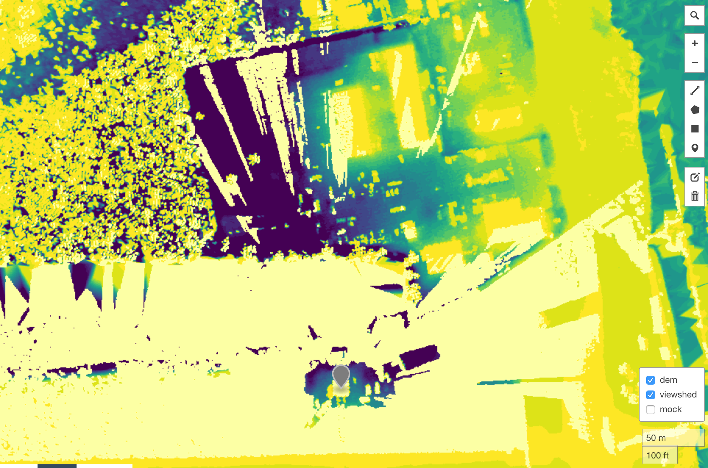

# GeoTrellis Levee PointCloud Demo

This demo provides a start-up guide for kicking the tires of GeoTrellis PointCloud support.



__Note:__ Point Cloud support in GeoTrellis is a feature that is being developed; a good deal of functionality is there, but the project organization and API are not where they need to be.
This means using it in it's current state will have a "rough around the edges" feel.
We're committed to finishing these features and functionality based on use cases.


## Initializing the development environment

This project can be worked on in a vagrant box, created with the vagrant file provided.
This is to provide the instructions against a clean environment.
To run inside the vagrant box, you'll need [vagrant](https://www.vagrantup.com/) installed, as well as a vagrant provider
such as [VirtualBox](https://www.virtualbox.org/).

To bring up the vagrant box, in this directory:

```
> vagrant up
```

_Note:_ You may want to mess around with the vb.memory and vb.cpu settings, if you are using VirtualBox.

Once the vagrant box is started, ssh inside of it

```
vagrant ssh
```

From there, we'll be interacting with `make` to perform different steps.
Look at the `Makefile` to see what those steps are doing.

_Note_: Expect the virtual machines to run slow with IO intensive tasks, such as building.
The Scala build times are especially slow on the VM in my experience.

## Directories

Inside the Vagrant box, there will be directories that map
to the directories of some other system to run the spark jobs.

- `$WORK`: This is where the point cloud data to be processed will be places.
- `$RUN`: This is where the code needed to run the processing will be placed.
- `$RESULT`: This is where results will be places, including a GeoTrellis catalog of raster layers
in `$RESULT/catalog`.

## Downloading the data

Run

```
make download-data
```

To download some example data, which is lidar from the USGS of
a levee in Barataria Bay, Louisiana.

To copy the data into `$WORK`, run

```
make copy-data
```

## Install PDAL JNI bindings.

We'll need to clone and and build pdal with the  java bindings.
GeoTrellis uses PDAL for all of it's pointcloud reading.
We can also take advantage of filters in PDAL, for instance to reproject
the points as we read them.

```
make build-pdal
```

## Build GeoTrellis with Point Cloud support

This command will clone the GeoTrellis repository, checkout the pointcloud feature branch,
and publish binaries to the local ivy2 cache for use with the codebase in this repository.

```
make build-geotrellis
```

## Download Spark

This command downloads and unzips Spark, which we'll use to execute our jobs.

```
make get-spark
```


## Build this project into an assembly (uber-jar)

This project contains code to ingest our test lidar as DEM, perform a viewshed
operation on a single point, and serve out tiles as a simple tile server to a leaflet map.
None of this code is robust, but should serve as an example of how GeoTrellis and Spark
can be used to process point cloud data.

This command will build the project, and create the "uber-jar" that can be run
through spark-submit as spark jobs.

```
make build-project
```

To copy the JAR into `$RUN`, run

```
make copy-code
```

## Check to see that PDAL bindings are working

This will execute the CountPoints.scala code in the project,
counting the points in our test data and proving that everything
is installed correctly. If there are issues here, the ingest and viewshed
jobs won't run.

Make sure all data and code is copied into `$WORK` and `$RUN`

```
scripts/run-count-points.pbs
```

## Ingest our lidar data into DEM

This reads in our test lidar data, converts it to DEM via a TIN mesh distributed algorithm,
and saves the raster tiles out to a GeoTrellis layer. A GeoTrellis layer of tiles is a
space-filling curve indexed tile set that allows GeoTrellis code to quickly retrieve individual tiles,
collections of tiles or Spark RDD's of tiles, and perform operations on them.

It also saves off a histogram of the base layer, so that the tile server can understand how to render
each tile according to the general distribution of values.

```
make ingest-dem
```

## Create

The layers this command creates is a set of pyramided layers in the "WebMercator" (EPSG:3857) CRS.
This allows us to render the tiles per zoom level on a web map.


## Compute a viewshed on the ingested DEM [TODO: FIX]

This performs a veiwshed operation for a point along the southwest levee wall, at
1.5 meters above the ground.

```
make compute-viewshed
```

## Start up a server that will show the DEM and viewshed on a web map

Included in the project is a small set of code that acts as a tile server,
which can render and serve up PNG tiles based on `{z}/{x}/{y}` calls that
are standard on web maps. It uses `akka-http`, and is
a small example of the actual tile servers typical in GeoTrellis development.

```
make serve-tiles
```

## Serve out the static content that shows the leaflet map

Also supplied is a small static page that shows a web map with a layer selector that
allows you to put the DEM and viewshed layers on a map.
While `serve-tiles` is still running (you'll have to start another `vagrant ssh` session), run:

```
make serve-static
```

Navigate to `http://localhost:8000`, and you should see a map with the elevation tiles.
Select the layers you want to see with the layer selector at the top-right part of the map.
The marker is placed where the viewshed was computed from.
The viewshed shows some data deficiencies over water, where you can see the viewshed
failing.
